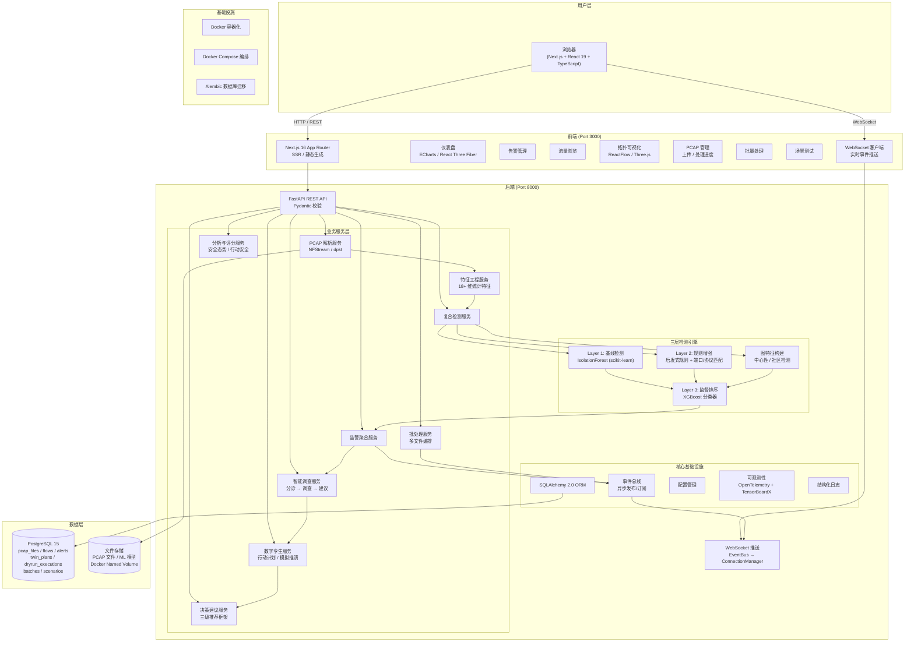
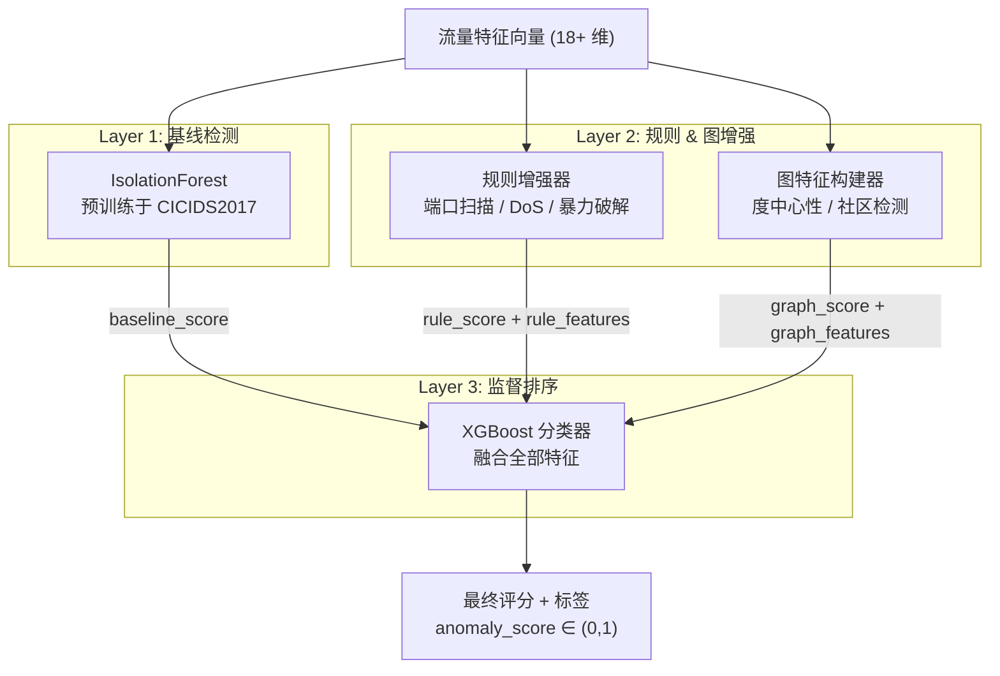
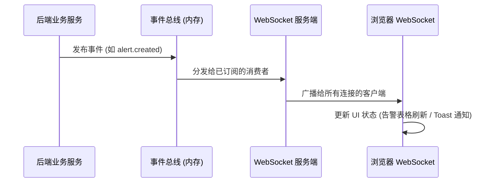
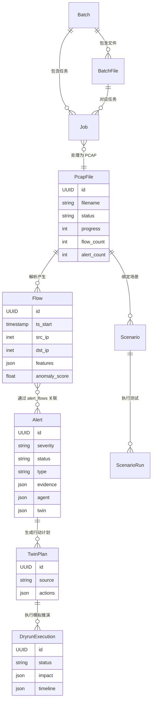
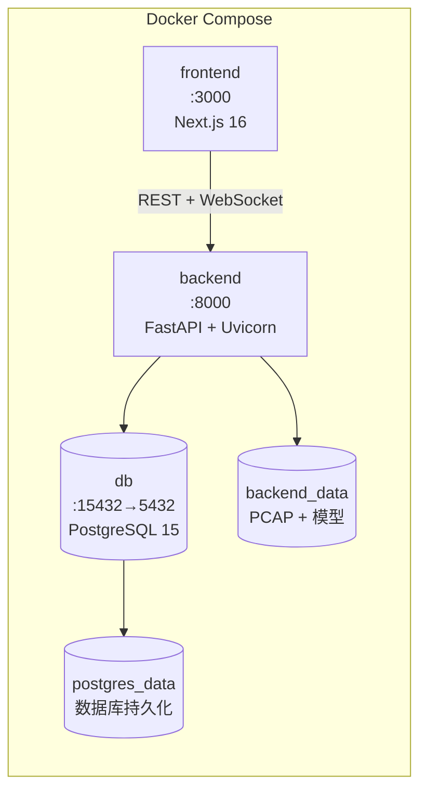

# NetTwin-SOC 系统概述

> **NetTwin-SOC** 是一个基于数字孪生的网络流量安全分析平台，能够对网络流量（PCAP 文件）进行解析、异常检测、告警生成、智能调查、模拟推演与决策建议，帮助安全运维人员快速定位威胁并安全地执行响应措施。

---

## 一、系统架构总览

---

## 二、核心工作流程

```mermaid
flowchart LR
    A["1. PCAP 上传"] --> B["2. 流量解析"]
    B --> C["3. 特征工程"]
    C --> D["4. 异常检测"]
    D --> E["5. 告警生成"]
    E --> F["6. 智能调查"]
    F --> G["7. 数字孪生推演"]
    G --> H["8. 决策建议"]

    style A fill:#4a9eff,color:#fff
    style B fill:#4a9eff,color:#fff
    style C fill:#5bb5a2,color:#fff
    style D fill:#5bb5a2,color:#fff
    style E fill:#f0a030,color:#fff
    style F fill:#f0a030,color:#fff
    style G fill:#e05050,color:#fff
    style H fill:#e05050,color:#fff
```

| 阶段 | 模块 | 输入 | 输出 | 说明 |
|------|------|------|------|------|
| **1. PCAP 上传** | Streaming Upload | 二进制 PCAP 文件 | PcapFile 记录 (status=uploaded) | 流式写入磁盘，实时计算 SHA256，支持 5 种 PCAP 格式 |
| **2. 流量解析** | ParsingService | PCAP 文件路径 | 原始流量记录列表 | 主策略: NFStream (C 层，5-20x 快)；备选: dpkt (纯 Python) |
| **3. 特征工程** | FeaturesService | 原始流量记录 | 18+ 维特征向量 | 时序特征、方向特征、统计特征、TCP 标志分析 |
| **4. 异常检测** | CompositeDetectionService | 特征向量 | anomaly_score + label | 三层检测：基线(IsolationForest) → 规则增强 → 图特征 → 监督排序(XGBoost) |
| **5. 告警生成** | AlertingService | 异常流量 | Alert 记录 | 按五元组 + 时间窗口聚合，关联 evidence 和 severity |
| **6. 智能调查** | AgentService | Alert | 分诊摘要 + 调查报告 + 建议 | 工作流引擎驱动：分诊 → 调查 → 威胁富化 → 建议 |
| **7. 数字孪生推演** | TwinService | 行动计划 | 模拟推演结果 | 拓扑图构建 → 可达性分析 → 影响评估 → 风险评分 |
| **8. 决策建议** | DecisionRecommender | 告警 + 推演结果 | 三级推荐方案 | 主方案 + 更安全替代方案 + 回滚计划，附置信度评分 |

---

## 三、模块详解

### 3.1 数据接入层

**PCAP 上传与管理**
- 支持流式上传（streaming-form-data），避免临时文件，直接写入磁盘
- 自动校验文件格式（Magic Number 检测，支持 5 种 PCAP 变体）
- 支持单文件处理和批量处理（Batch）两种模式
- 通过 WebSocket 实时推送处理进度

### 3.2 流量解析与特征工程

**解析策略**
- **NFStream**（主策略）：C 层高性能解析，双向流聚合，空闲/活跃超时控制
- **dpkt**（备选策略）：纯 Python 解析，Windows 兼容，固定时间窗口聚合

**特征维度**（18+ 维）
- 时序特征：流持续时间、到达间隔均值/标准差
- 方向特征：正向/反向包比例、字节比例、平均包大小
- 统计特征：总包数、每包字节数
- 标志特征：SYN/ACK/FIN/RST 计数
- 协议特征：is_tcp、is_udp

### 3.3 三层复合检测引擎

### 3.4 告警与智能调查

**告警聚合**：将异常流量按五元组 + 时间窗口聚合为告警，附带 evidence（top flows、top features）和 severity（low/medium/high/critical）。

**工作流引擎**（4 阶段）：
1. **分诊（Triage）**：快速摘要告警严重程度、涉及流数量
2. **调查（Investigate）**：生成假设 + 证据链
3. **威胁富化（Threat Enrichment）**：关联外部威胁情报
4. **建议（Recommend）**：提出响应动作建议

### 3.5 数字孪生推演

- 从当前流量数据构建**网络拓扑图**
- 将计划动作（封禁 IP、隔离服务等）应用到拓扑
- **可达性分析**：BFS 遍历，计算服务间连通性变化
- **影响评估**：服务中断风险、受影响节点数、替代路径
- **风险评分**：综合服务重要性、流量影响和关键性评估

### 3.6 决策建议

三级推荐框架：
| 级别 | 内容 | 触发条件 |
|------|------|---------|
| 主方案 | 最优响应动作 | 高置信度 + 低风险 |
| 更安全替代 | 低风险备选方案 | disruption_risk > 0.5 或 confidence < 0.6 |
| 回滚计划 | 恢复方案 | 始终提供 |

### 3.7 分析与评分

- **安全态势评分**（Posture Score）：综合威胁覆盖度、置信度、严重性权重
- **行动安全评分**（Action Safety Score）：评估响应动作的安全性
- **趋势分析**：24h 时间序列指标
- **分布统计**：告警类型、严重性分布

---

## 四、前端页面结构

| 页面 | 路由 | 功能 | 可视化技术 |
|------|------|------|-----------|
| 仪表盘 | `/` | 安全态势总览、实时指标、活动流 | ECharts (趋势图)、React Three Fiber (3D 拓扑) |
| 告警管理 | `/alerts` | 告警列表、筛选、实时更新 | 表格 + WebSocket 实时推送 |
| 告警详情 | `/alerts/[id]` | 证据链、调查报告、推演结果 | 时间线、关联图 |
| 流量浏览 | `/flows` | 五元组搜索、异常评分排序 | 数据表格 |
| PCAP 管理 | `/pcaps` | 拖拽上传、处理进度 | 进度条 + WebSocket |
| 拓扑视图 | `/topology` | 网络通信拓扑、风险着色 | ReactFlow / Three.js (3D 力导向图) |
| 批量处理 | `/batch` | 多文件批量处理、任务状态 | 进度追踪 |
| 场景测试 | `/scenarios` | 测试场景定义与执行 | 执行时间线 |

---

## 五、事件驱动与实时通信

**主要事件类型**：
- `pcap.process.progress / done / failed` — PCAP 处理进度
- `alert.created / updated` — 告警变更
- `twin.dryrun.created` — 推演完成
- `batch.job.stage.*` — 批处理任务阶段
- `pipeline.stage.completed` — 流水线阶段完成

---

## 六、数据模型关系

---

## 七、技术栈全览

### 后端
| 类别 | 技术 |
|------|------|
| Web 框架 | **FastAPI** + **Uvicorn** (ASGI) |
| 数据校验 | **Pydantic** |
| ORM | **SQLAlchemy 2.0** |
| 数据库 | **PostgreSQL 15** |
| 数据库迁移 | **Alembic** |
| 流量解析 | **NFStream** (C 层高性能) / **dpkt** (纯 Python 备选) |
| 异常检测 | **scikit-learn** (IsolationForest) |
| 监督学习 | **XGBoost** |
| 数值计算 | **NumPy** / **SciPy** |
| 模型持久化 | **joblib** |
| 流式上传 | **streaming-form-data** |
| 可观测性 | **OpenTelemetry** (gRPC exporter) |
| 训练可视化 | **TensorBoardX** |

### 前端
| 类别 | 技术 |
|------|------|
| 框架 | **Next.js 16** (App Router, SSR/SSG) |
| UI 库 | **React 19** + **TypeScript 5** |
| 样式 | **TailwindCSS 4** + **PostCSS** |
| 图表 | **ECharts 6** |
| 3D 渲染 | **React Three Fiber** / **Three.js** |
| 图/拓扑 | **ReactFlow** |
| 粒子效果 | **Particles.js** |
| 实时通信 | **WebSocket** (原生) |

### 基础设施
| 类别 | 技术 |
|------|------|
| 容器化 | **Docker** (多阶段构建) |
| 编排 | **Docker Compose** |
| 测试 | **pytest** + **pytest-asyncio** |
| 包管理 | **pip** (后端) / **npm** (前端) |

---

## 八、部署架构

- **frontend**：Next.js 开发服务器，多阶段构建（deps → dev → builder → runner）
- **backend**：Uvicorn 热重载，挂载源码 + 模型 + 数据卷
- **db**：PostgreSQL 15 Alpine，健康检查（pg_isready），端口映射 15432→5432
- 所有数据通过 Docker Named Volume 持久化

---

## 九、一句话总结

**NetTwin-SOC = PCAP 流量解析 + 三层 AI 异常检测 + 智能告警调查 + 数字孪生模拟推演 + 安全决策建议**，是一个从「数据接入 → 威胁发现 → 影响评估 → 响应决策」的全链路网络安全运维平台。
