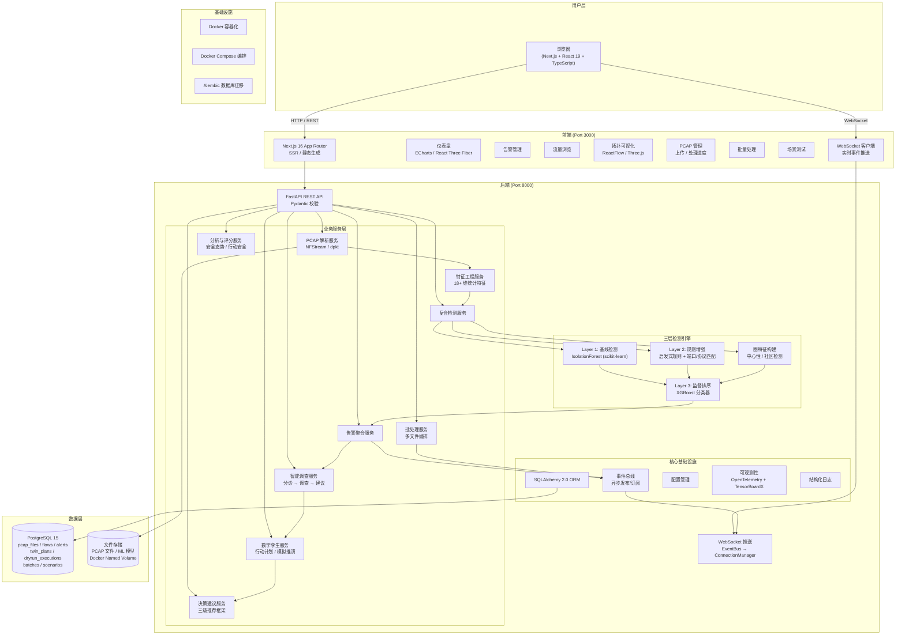
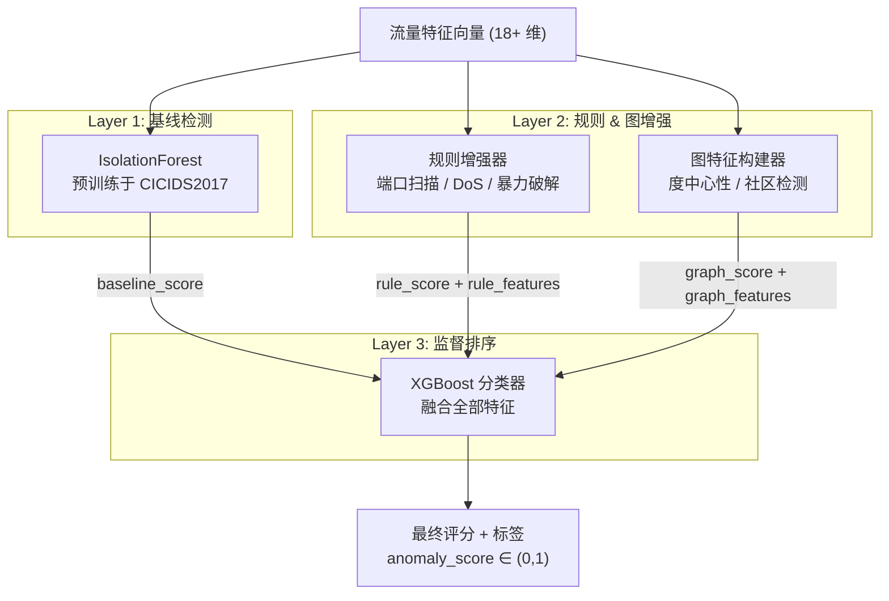
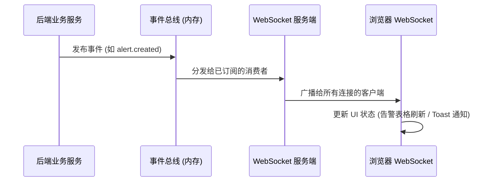
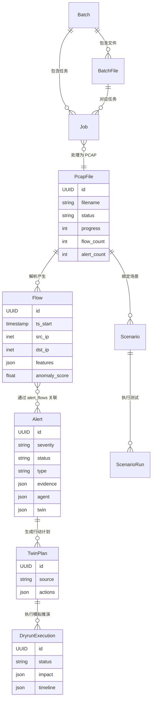
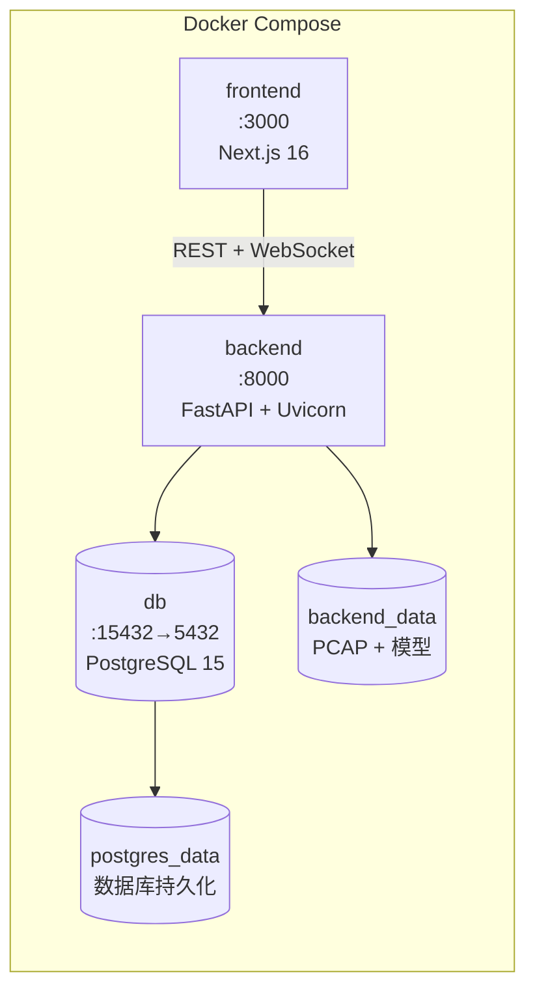
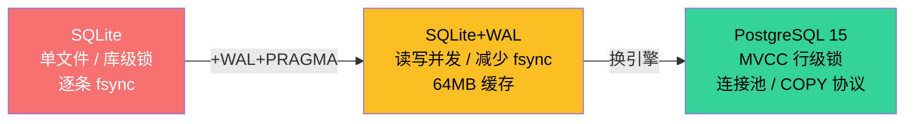
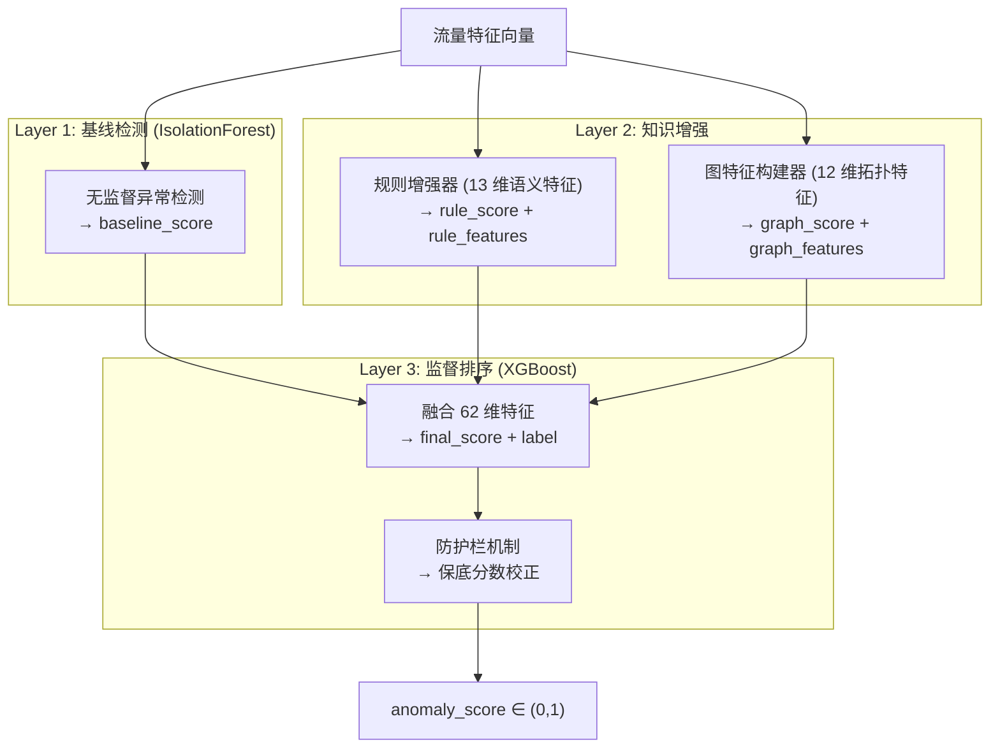
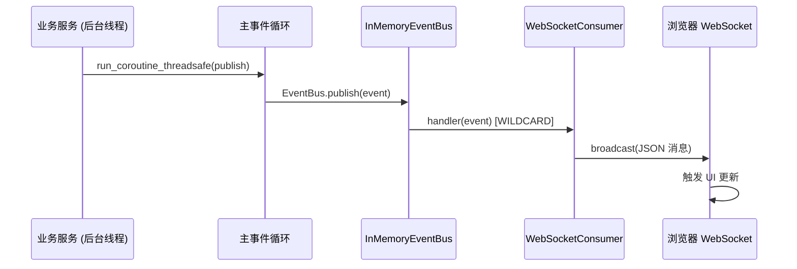
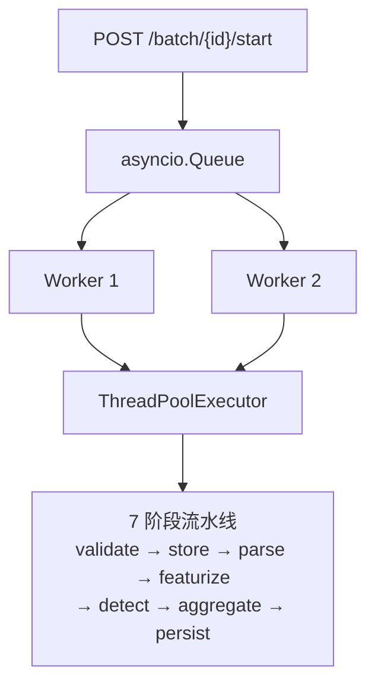
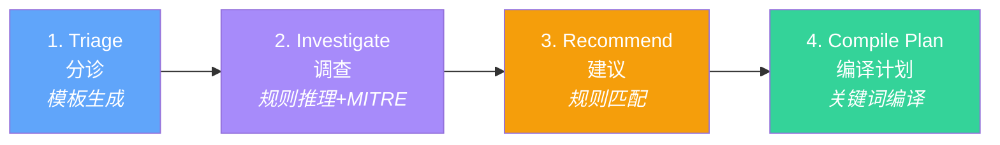

# NetTwin-SOC 项目介绍

> **NetTwin-SOC** 是一个基于数字孪生的网络流量安全分析平台，能够对网络流量（PCAP 文件）进行解析、异常检测、告警生成、智能调查、模拟推演与决策建议，帮助安全运维人员快速定位威胁并安全地执行响应措施。

---

## 全局目录

### 第一部分：项目概述
- [一、系统架构总览](#一系统架构总览)
- [二、核心工作流程](#二核心工作流程)
- [三、模块详解](#三模块详解)
  - [3.1 数据接入层](#31-数据接入层)
  - [3.2 流量解析与特征工程](#32-流量解析与特征工程)
  - [3.3 PCAP → Flow → Alert 处理流水线](#33-pcap--flow--alert-处理流水线)
  - [3.4 三层复合检测引擎](#34-三层复合检测引擎)
  - [3.5 告警与智能调查](#35-告警与智能调查)
  - [3.6 数字孪生推演](#36-数字孪生推演)
  - [3.7 决策建议](#37-决策建议)
  - [3.8 分析与评分](#38-分析与评分)
- [四、前端页面结构](#四前端页面结构)
- [五、事件驱动与实时通信](#五事件驱动与实时通信)
- [六、数据模型关系](#六数据模型关系)
- [七、技术栈全览](#七技术栈全览)
- [八、部署架构](#八部署架构)

### 第二部分：技术详解
- [一、数据存储与持久化](#一数据存储与持久化)
  - [1.1 数据库引擎演进](#11-数据库引擎演进sqlitesqlitewalpostgresql)
  - [1.2 数据写入策略演进](#12-数据写入策略演进)
  - [1.3 数据落盘路径优化](#13-数据落盘路径优化bind-mountlinux-named-volume)
  - [1.4 Alembic 数据库迁移](#14-alembic-数据库迁移)
- [二、数据接入](#二数据接入)
  - [2.1 文件上传演进](#21-文件上传演进python-multipartstreaming-form-data)
  - [2.2 PCAP 解析引擎演进](#22-pcap-解析引擎演进dpktnfstream)
- [三、特征工程与数据流转](#三特征工程与数据流转)
  - [3.1 PCAP → Flow → Alert 端到端数据变换](#31-pcap--flow--alert-端到端数据变换)
  - [3.2 流量特征提取（36+ 维）](#32-流量特征提取36-维)
- [四、三层复合检测引擎](#四三层复合检测引擎)
  - [4.1 Layer 1：IsolationForest 基线检测](#41-layer-1isolationforest-基线检测)
  - [4.2 Layer 2a：RuleEnricher 规则增强器](#42-layer-2aruleenricher-规则增强器)
  - [4.3 Layer 2b：GraphFeatureBuilder 图特征构建器](#43-layer-2bgraphfeaturebuilder-图特征构建器)
  - [4.4 Graph Feature 算法优化](#44-graph-feature-算法优化从卡死到秒级)
  - [4.5 Layer 3：SupervisedRanker（XGBoost）](#45-layer-3supervisedranker-监督排序器xgboost)
  - [4.6 防护栏机制（Guardrails）](#46-防护栏机制guardrails)
  - [4.7 检测服务单例化](#47-检测服务单例化)
- [五、告警聚合与评分](#五告警聚合与评分)
- [六、事件驱动与实时通信](#六事件驱动与实时通信-1)
- [七、流水线编排与批量调度](#七流水线编排与批量调度)
- [八、评分体系](#八评分体系)
  - [8.1 安全态势评分](#81-安全态势评分posture-score0-100)
  - [8.2 行动安全评分](#82-行动安全评分action-safety-score0-100)
  - [8.3 告警置信度计算](#83-告警置信度计算)
- [九、AI 研判工作流](#九ai-研判工作流)
  - [9.1 WorkflowEngine 四阶段引擎](#91-workflowengine-四阶段引擎)
  - [9.2 Stage 1：Triage 分诊](#92-stage-1triage-分诊)
  - [9.3 Stage 2：Investigate 调查](#93-stage-2investigate-调查)
  - [9.4 Stage 3：Recommend 建议](#94-stage-3recommend-建议)
  - [9.5 Stage 4：Compile Plan 编译计划](#95-stage-4compile-plan-编译计划)
  - [9.6 威胁富化（MITRE ATT&CK 本地知识库）](#96-威胁富化mitre-attck-本地知识库)
  - [9.7 准确性与可靠性保障机制](#97-准确性与可靠性保障机制)
- [十、数字孪生推演引擎](#十数字孪生推演引擎)
- [十一、决策三级推荐框架](#十一决策三级推荐框架)
- [十二、网络拓扑可视化](#十二网络拓扑可视化)
- [十三、场景回归测试](#十三场景回归测试)
- [十四、可观测性（OpenTelemetry）](#十四可观测性opentelemetry)
- [十五、容器化部署](#十五容器化部署)

---

# 第一部分：项目概述

## 一、系统架构总览



---

## 二、核心工作流程


| 阶段 | 模块 | 输入 | 输出 | 说明 |
|------|------|------|------|------|
| **1. PCAP 上传** | Streaming Upload | 二进制 PCAP 文件 | PcapFile 记录 (status=uploaded) | 流式写入磁盘，实时计算 SHA256，支持 5 种 PCAP 格式 |
| **2. 流量解析** | ParsingService | PCAP 文件路径 | 原始流量记录列表 | 主策略: NFStream (C 层，5-20x 快)；备选: dpkt (纯 Python) |
| **3. 特征工程** | FeaturesService | 原始流量记录 | 18+ 维特征向量 | 时序特征、方向特征、统计特征、TCP 标志分析 |
| **4. 异常检测** | CompositeDetectionService | 特征向量 | anomaly_score + label | 三层检测：基线(IsolationForest) → 规则增强 → 图特征 → 监督排序(XGBoost) |
| **5. 告警生成** | AlertingService | 异常流量 | Alert 记录 | 按五元组 + 时间窗口聚合，关联 evidence 和 severity |
| **6. 智能调查** | AgentService | Alert | 分诊摘要 + 调查报告 + 建议 | 工作流引擎驱动：分诊 → 调查 → 威胁富化 → 建议 |
| **7. 数字孪生推演** | TwinService | 行动计划 | 模拟推演结果 | 拓扑图构建 → 可达性分析 → 影响评估 → 风险评分 |
| **8. 决策建议** | DecisionRecommender | 告警 + 推演结果 | 三级推荐方案 | 主方案 + 更安全替代方案 + 回滚计划，附置信度评分 |

---

## 三、模块详解

### 3.1 数据接入层

**PCAP 上传与管理**
- 支持流式上传（streaming-form-data），避免临时文件，直接写入磁盘
- 自动校验文件格式（Magic Number 检测，支持 5 种 PCAP 变体）
- 支持单文件处理和批量处理（Batch）两种模式
- 通过 WebSocket 实时推送处理进度

### 3.2 流量解析与特征工程

**解析策略**
- **NFStream**（主策略）：C 层高性能解析，双向流聚合，空闲/活跃超时控制
- **dpkt**（备选策略）：纯 Python 解析，Windows 兼容，固定时间窗口聚合

**特征维度**（18+ 维）
- 时序特征：流持续时间、到达间隔均值/标准差
- 方向特征：正向/反向包比例、字节比例、平均包大小
- 统计特征：总包数、每包字节数
- 标志特征：SYN/ACK/FIN/RST 计数
- 协议特征：is_tcp、is_udp

### 3.3 PCAP → Flow → Alert 处理流水线

一个 PCAP 文件从上传到产出告警，经历以下数据变换链路：


**各环节关键变换**：

| 环节 | 输入 | 使用技术 | 关键变换 | 输出 |
|------|------|---------|---------|------|
| 解析 | PCAP 二进制 | NFStream (C 层) / dpkt | 逐包解码 → 超时/窗口聚合 → 双向流识别 | Flow dict（五元组 + 包/字节统计 + TCP 标志 + 时间戳） |
| 特征提取 | Flow dict | 纯 Python 计算 | 原始统计 → 36+ 维特征向量（比例、IAT、完整性、不对称度等） | Flow dict + `features` 字段 |
| 异常检测 | Flow + features | IsolationForest + RuleEnricher + XGBoost | 18 维基线评分 → 13 维规则特征 → 12 维图特征 → 62 维融合评分 | Flow dict + `anomaly_score` ∈ [0,1] |
| 告警生成 | 异常 Flow (score≥0.7) | 多维聚合 + 复合评分 | 按 src_ip+目标+服务+类型+时间窗口 聚合 → 四维复合评分 → 严重性分级 | Alert（severity + evidence + aggregation） |

> 详细的数据结构变换和每个环节的具体实现，参见第二部分「三、特征工程与数据流转」。

### 3.4 三层复合检测引擎



### 3.5 告警与智能调查

**告警聚合**：将异常流量按五元组 + 时间窗口聚合为告警，附带 evidence（top flows、top features）和 severity（low/medium/high/critical）。

**工作流引擎**（4 阶段）：
1. **分诊（Triage）**：快速摘要告警严重程度、涉及流数量
2. **调查（Investigate）**：生成假设 + 证据链
3. **威胁富化（Threat Enrichment）**：关联外部威胁情报
4. **建议（Recommend）**：提出响应动作建议

### 3.6 数字孪生推演

- 从当前流量数据构建**网络拓扑图**
- 将计划动作（封禁 IP、隔离服务等）应用到拓扑
- **可达性分析**：BFS 遍历，计算服务间连通性变化
- **影响评估**：服务中断风险、受影响节点数、替代路径
- **风险评分**：综合服务重要性、流量影响和关键性评估

### 3.7 决策建议

三级推荐框架：
| 级别 | 内容 | 触发条件 |
|------|------|---------|
| 主方案 | 最优响应动作 | 高置信度 + 低风险 |
| 更安全替代 | 低风险备选方案 | disruption_risk > 0.5 或 confidence < 0.6 |
| 回滚计划 | 恢复方案 | 始终提供 |

### 3.8 分析与评分

- **安全态势评分**（Posture Score）：综合威胁覆盖度、置信度、严重性权重
- **行动安全评分**（Action Safety Score）：评估响应动作的安全性
- **趋势分析**：24h 时间序列指标
- **分布统计**：告警类型、严重性分布

---

## 四、前端页面结构

| 页面 | 路由 | 功能 | 可视化技术 |
|------|------|------|-----------|
| 仪表盘 | `/` | 安全态势总览、实时指标、活动流 | ECharts (趋势图)、React Three Fiber (3D 拓扑) |
| 告警管理 | `/alerts` | 告警列表、筛选、实时更新 | 表格 + WebSocket 实时推送 |
| 告警详情 | `/alerts/[id]` | 证据链、调查报告、推演结果 | 时间线、关联图 |
| 流量浏览 | `/flows` | 五元组搜索、异常评分排序 | 数据表格 |
| PCAP 管理 | `/pcaps` | 拖拽上传、处理进度 | 进度条 + WebSocket |
| 拓扑视图 | `/topology` | 网络通信拓扑、风险着色 | ReactFlow / Three.js (3D 力导向图) |
| 批量处理 | `/batch` | 多文件批量处理、任务状态 | 进度追踪 |
| 场景测试 | `/scenarios` | 测试场景定义与执行 | 执行时间线 |

---

## 五、事件驱动与实时通信



**主要事件类型**：
- `pcap.process.progress / done / failed` — PCAP 处理进度
- `alert.created / updated` — 告警变更
- `twin.dryrun.created` — 推演完成
- `batch.job.stage.*` — 批处理任务阶段
- `pipeline.stage.completed` — 流水线阶段完成

---

## 六、数据模型关系



---

## 七、技术栈全览

### 后端
| 类别 | 技术 |
|------|------|
| Web 框架 | **FastAPI** + **Uvicorn** (ASGI) |
| 数据校验 | **Pydantic** |
| ORM | **SQLAlchemy 2.0** |
| 数据库 | **PostgreSQL 15** |
| 数据库迁移 | **Alembic** |
| 流量解析 | **NFStream** (C 层高性能) / **dpkt** (纯 Python 备选) |
| 异常检测 | **scikit-learn** (IsolationForest) |
| 监督学习 | **XGBoost** |
| 数值计算 | **NumPy** / **SciPy** |
| 模型持久化 | **joblib** |
| 流式上传 | **streaming-form-data** |
| 可观测性 | **OpenTelemetry** (gRPC exporter) |
| 训练可视化 | **TensorBoardX** |

### 前端
| 类别 | 技术 |
|------|------|
| 框架 | **Next.js 16** (App Router, SSR/SSG) |
| UI 库 | **React 19** + **TypeScript 5** |
| 样式 | **TailwindCSS 4** + **PostCSS** |
| 图表 | **ECharts 6** |
| 3D 渲染 | **React Three Fiber** / **Three.js** |
| 图/拓扑 | **ReactFlow** |
| 粒子效果 | **Particles.js** |
| 实时通信 | **WebSocket** (原生) |

### 基础设施
| 类别 | 技术 |
|------|------|
| 容器化 | **Docker** (多阶段构建) |
| 编排 | **Docker Compose** |
| 测试 | **pytest** + **pytest-asyncio** |
| 包管理 | **pip** (后端) / **npm** (前端) |

---

## 八、部署架构



- **frontend**：Next.js 开发服务器，多阶段构建（deps → dev → builder → runner）
- **backend**：Uvicorn 热重载，挂载源码 + 模型 + 数据卷
- **db**：PostgreSQL 15 Alpine，健康检查（pg_isready），端口映射 15432→5432
- 所有数据通过 Docker Named Volume 持久化


# 第二部分：技术详解

> 本部分按技术领域分类，详细介绍项目中每项技术的设计思路、算法原理、关键参数及其迭代演进过程。对于经历过技术升级的模块，会以「迭代对比」的形式说明优化前后的差异。

---

## 一、数据存储与持久化

### 1.1 数据库引擎演进：SQLite → SQLite+WAL → PostgreSQL

本项目数据库经历了三个阶段的演进：

#### 阶段一：SQLite（初始版本）

SQLite 是一个嵌入式关系数据库，以单个文件（`nettwin.db`）存储全部数据，无需独立的数据库服务进程。零配置即可启动开发，无需安装数据库服务，降低初始开发门槛。后端通过 SQLAlchemy ORM 连接 `sqlite:///./data/nettwin.db`。

**局限性**：
- 写锁粒度为整库（database-level lock），并发写入时会阻塞
- 不支持连接池（嵌入式单线程模型）
- 大规模数据（50 万+ 流记录）写入性能极差——逐条 INSERT 每条都触发一次 fsync

#### 阶段二：SQLite + WAL 优化

通过 SQLite 的 PRAGMA 配置开启 WAL（Write-Ahead Logging）模式及多项性能参数。在不更换数据库引擎的前提下，大幅提升写入吞吐量。

**关键参数与含义**：

| PRAGMA 设置 | 值 | 含义 | 为什么这样设 | 调整建议 |
|-------------|-----|------|-------------|---------|
| `journal_mode=WAL` | WAL | 使用预写日志替代回滚日志 | WAL 模式允许读写并发：读操作不阻塞写，写操作不阻塞读。传统 rollback journal 在写入时会锁住整个数据库 | 生产环境始终使用 WAL；仅在只读场景可用 DELETE 模式 |
| `synchronous=NORMAL` | NORMAL | 控制 fsync 频率 | FULL 模式每次写操作都 fsync（安全但极慢）；NORMAL 模式只在 checkpoint 时 fsync，牺牲极小的断电丢失风险换取约 3 倍写入速度 | 对数据绝对安全性要求高的场景改为 FULL |
| `cache_size=-64000` | 64MB | 页面缓存大小（负值表示 KB） | 默认 2MB 缓存在大量流记录写入时频繁换页；64MB 可容纳约 15000 个 4KB 页面，显著减少磁盘 I/O | 内存充裕可增至 128MB（`-128000`），内存紧张则降至 32MB |
| `temp_store=MEMORY` | MEMORY | 临时表存储位置 | 将 ORDER BY、GROUP BY 产生的临时数据放入内存，避免临时文件 I/O | 如果排序数据量极大可能撑爆内存，此时改为 FILE |

**实现方式**：通过 SQLAlchemy 的 `event.listens_for(engine, "connect")` 机制，在每个新连接建立时自动执行 PRAGMA 设置。

#### 阶段三：PostgreSQL 15

PostgreSQL 是一个企业级关系数据库，支持 MVCC（多版本并发控制）、连接池、高级索引和 COPY 协议。

- **并发写入**：MVCC 使读写完全不阻塞（行级锁而非库级锁）
- **连接池复用**：避免每次请求创建/销毁 TCP 连接的开销
- **COPY 协议**：二进制流式写入，比 INSERT 快 10-20 倍
- **容器化部署**：`postgres:15-alpine` 镜像开箱即用

**关键参数**：

```python
engine = create_engine(
    settings.DATABASE_URL,
    pool_size=10,        # 常驻连接数
    max_overflow=20,     # 高峰时额外连接数（总计最大 30）
    pool_pre_ping=True,  # 取出连接前先 ping 检测存活
    echo=settings.DEBUG,
)
```

| 参数 | 值 | 含义 | 为什么这样设 | 调整建议 |
|------|-----|------|-------------|---------|
| `pool_size` | 10 | 连接池常驻连接数 | 10 个连接足以覆盖常规并发（API 请求 + 后台任务），PostgreSQL 默认最大 100 连接 | 高并发场景可增至 20，但需同步调整 PostgreSQL 的 `max_connections` |
| `max_overflow` | 20 | 突发时额外创建的连接数 | 处理批量任务（Batch）时可能有 2 个 Worker 线程 + 多个 API 请求同时访问数据库 | 减少到 10 可降低资源占用，增加到 30 可应对更高峰值 |
| `pool_pre_ping` | True | 使用前检测连接存活 | PostgreSQL 可能因网络中断、idle_timeout 等原因断开空闲连接，pre_ping 避免用到死连接 | 始终保持 True，极低性能开销但避免连接异常 |

**驱动**：`psycopg2-binary`（PostgreSQL 的 C 语言 Python 适配器，比纯 Python 驱动快数倍）。

#### 迭代对比



| 维度 | SQLite 原始 | SQLite + WAL | PostgreSQL 15 |
|------|------------|--------------|---------------|
| 并发模型 | 库级写锁 | 读写分离（WAL） | MVCC 行级锁 |
| 连接管理 | 无连接池 | 无连接池 | pool_size=10 + overflow=20 |
| 50 万条写入 | 数十分钟（逐条 fsync） | 数十秒（批量 + WAL） | 数秒（COPY 协议） |
| 适用场景 | 开发/原型 | 中等数据量 | 生产环境 |

---

### 1.2 数据写入策略演进

#### 阶段一：SQLAlchemy ORM 逐条 INSERT

**问题**：每条 `db.add()` 产生一条 INSERT SQL，50 万条流记录 = 50 万次 TCP 往返 + ORM 对象创建开销。

#### 阶段二：SQLAlchemy Core Bulk Insert + 单次 Commit

```python
db.execute(Flow.__table__.insert(), flow_dicts)  # 批量 INSERT
db.commit()  # 一次 fsync
```

**优化**：绕过 ORM 对象层，直接使用 Core `insert()` 传入字典列表，数据库驱动内部使用 `executemany`。单次 `commit()` 将所有写入合并为一个事务。

#### 阶段三：PostgreSQL COPY 协议（当前版本）

PostgreSQL 的 COPY 协议是一种专为批量数据加载设计的二进制流式传输协议，绕过 SQL 解析器，直接将数据流写入表的存储层。构建 TSV 格式的内存缓冲区（Tab 分隔，`\N` 表示 NULL），通过 psycopg2 的 `cursor.copy_from()` 一次性传输：

```python
raw_conn = db.connection().connection  # 获取底层 psycopg2 连接
buf = io.StringIO()
for fd in flow_dicts:
    row = "\t".join([fd["id"], fd["version"], ...])
    buf.write(row + "\n")
buf.seek(0)
cursor = raw_conn.cursor()
cursor.copy_from(buf, "flows", columns=columns, null="\\N")
```

**为什么快**：不需要为每行构建 INSERT 语句、解析 SQL、生成执行计划；数据以 TSV 流一次性传输，只有一次网络往返和一次 fsync。

| 写入方式 | 50 万条流记录耗时 | fsync 次数 | 网络往返 |
|---------|------------------|-----------|---------|
| ORM 逐条 INSERT | 数分钟 | 50 万次 | 50 万次 |
| Core executemany | 约 30 秒 | 1 次 | 约 5000 次（批量） |
| COPY 协议 | 约 3 秒 | 1 次 | 1 次 |

### 1.3 数据落盘路径优化：bind mount → Linux Named Volume

#### 优化前：跨 OS bind mount（慢 10 倍）

初始架构下，数据落盘路径为：

```
浏览器 → 后端（宿主机 Windows 进程） → 写入 Windows NTFS 磁盘
                                           ↓
Docker 容器通过 bind mount 跨 OS 读取（Windows NTFS → Linux VFS 转译）
```

**问题根源**：Docker Desktop for Windows 使用 WSL2 后端，bind mount 将 Windows 宿主机的 NTFS 目录挂载到 Linux 容器内。每次文件 I/O 都需要经过 **9P 协议（Plan 9 Filesystem Protocol）** 进行 Windows ↔ Linux 的文件系统转译。这个转译层导致：
- **随机读写延迟增加 5-10 倍**（每次 I/O 经过 NTFS → 9P → ext4 转译链路）
- **大文件顺序写入也受影响**（无法利用 Linux 内核的页缓存优化）
- **NFStream C 层解析直接读取 bind mount 路径时**，性能从原生的「秒级」退化到「数十秒」

#### 优化后：Docker Named Volume（原生速度）

```
浏览器 → 后端（Docker 容器内） → 直接写入 Linux Named Volume（ext4 原生速度）
```

**Named Volume 原理**：Docker Named Volume 是由 Docker 引擎管理的存储卷，其数据直接存放在 WSL2 Linux 虚拟机内的 ext4 文件系统中，完全绕过 9P 协议和 NTFS 转译层。

**实现方式**（docker-compose.yml）：

```yaml
volumes:
  backend_data:        # Named Volume，Docker 引擎管理
    driver: local      # 存储在 WSL2 的 ext4 文件系统中

services:
  backend:
    volumes:
      - backend_data:/app/data    # 容器内直接访问 ext4
```

#### 迭代对比

| 维度 | bind mount (Windows NTFS) | Named Volume (Linux ext4) |
|------|--------------------------|--------------------------|
| I/O 路径 | NTFS → 9P 协议 → ext4 转译 | ext4 直接访问 |
| 随机读写延迟 | 5-10 倍退化 | 原生速度 |
| NFStream 解析 100MB PCAP | 数十秒 | 数秒 |
| COPY 协议写入 50 万条流 | 受 I/O 瓶颈拖累 | 约 3 秒（原生） |
| 宿主机可见性 | 可在 Windows 资源管理器中直接访问 | 需通过 `docker cp` 或容器内访问 |

> 这项优化与 COPY 协议写入是互补的：COPY 协议优化了「数据库写入效率」，Named Volume 优化了「底层磁盘 I/O 效率」，两者共同将 50 万条流记录的端到端写入时间从分钟级降到秒级。

### 1.4 Alembic 数据库迁移

Alembic 是 SQLAlchemy 的数据库模式版本控制工具，以 Python 脚本描述表结构变更，支持升级（upgrade）和回退（downgrade）。所有表结构变更（新增表、添加列、创建索引）均通过 Alembic 迁移脚本管理，确保开发环境和生产环境数据库结构一致。

迁移过程使用 `NullPool`（不使用连接池），避免在 DDL 操作期间连接复用导致的状态不一致。

---

## 二、数据接入

### 2.1 文件上传演进：python-multipart → streaming-form-data

#### python-multipart（初始版本）

FastAPI 默认的 multipart/form-data 解析库，将上传文件完整读入内存后写入磁盘。**问题**：大 PCAP 文件（数百 MB）上传时内存占用与文件大小成正比。

#### streaming-form-data + SHA256 实时计算（当前版本）

streaming-form-data 是一个流式 multipart 解析库，边接收 HTTP 数据块边写入磁盘，内存占用恒定（约 64KB）。固定内存占用 + 写入时同步计算 SHA256 + 首个数据块即校验 Magic Number。自定义 `_HashingFileTarget`，在 `on_data_received` 回调中同时执行三项操作：

```python
class _HashingFileTarget(FileTarget):
    def on_data_received(self, chunk: bytes):
        if self._size == 0:
            self._magic = chunk[:4]       # 首 chunk 提取 Magic Number
        self._hasher.update(chunk)         # 增量更新 SHA256
        self._size += len(chunk)
        super().on_data_received(chunk)    # 写入磁盘
```

**PCAP Magic Number 验证**（5 种有效格式）：`0xA1B2C3D4`（PCAP 大端）、`0xD4C3B2A1`（PCAP 小端）、`0xA1B23C4D`（PCAP-NG 大端变体）、`0x4D3CB2A1`（PCAP-NG 小端变体）、`0x0A0D0D0A`（PCAP-NG Section Header Block）。

**浏览器端 Gzip 压缩**：客户端使用 `CompressionStream` API 压缩后上传（减少 2-3 倍传输量），服务端通过 `X-Content-Encoding: gzip` 头检测并用 `zlib.decompressobj(MAX_WBITS | 16)` 流式解压。

#### 迭代对比

| 维度 | python-multipart | streaming-form-data |
|------|-----------------|-------------------|
| 内存占用 | 与文件大小成正比 | 恒定 64KB |
| SHA256 计算 | 上传后二次读取 | 写入时同步计算 |
| Magic 校验 | 上传后再校验 | 首个 chunk 即校验 |
| Gzip 支持 | 无 | 流式解压 |

### 2.2 PCAP 解析引擎演进：dpkt → NFStream

#### dpkt（初始版本 / 备选方案）

dpkt 是一个纯 Python 的网络报文解析库，逐包读取 PCAP 文件，支持 Ethernet/IP/TCP/UDP/ICMP 层解码。提供基础的 PCAP 解析能力，跨平台兼容（特别是 Windows 环境下 NFStream 不可用时）。

**工作原理**：
1. 打开 PCAP/PCAP-NG 文件，逐包迭代解析 Ethernet → IP → Transport 层
2. **固定时间窗口聚合**（默认 60 秒）：以 `(src_ip, src_port, dst_ip, dst_port, proto, bucket_start)` 为 key 将同一窗口内的包聚合为一条「流」
3. 追踪流发起方（第一个源端点），分别统计正向/反向的包数和字节数
4. 提取 TCP 标志位：SYN(0x02)、ACK(0x10)、FIN(0x01)、RST(0x04)、PSH(0x08)
5. 记录每包时间戳（用于后续 IAT 计算）

**局限性**：纯 Python 实现，解析速度约 5 万包/秒；窗口聚合是近似的流识别，不如基于连接超时的方式精确。

#### NFStream（当前主策略）

NFStream 是基于 C 语言实现的高性能网络流提取库，底层使用 nDPI 深度包检测引擎，支持双向流自动聚合。将 PCAP 解析速度提升 5-20 倍，同时提供更精确的流识别。

**关键参数**：

| 参数 | 值 | 含义 | 为什么这样设 | 调整建议 |
|------|-----|------|-------------|---------|
| `idle_timeout` | 120s | 若连续 120 秒无新包，流视为结束 | 120 秒覆盖大多数 TCP keep-alive 间隔（通常 60-120s），太短会把一次长连接拆成多条流，太长会延迟检测 | 对实时性要求高可降至 60s；分析长连接可增至 300s |
| `active_timeout` | 1800s | 即使持续有包，30 分钟后也强制截断流 | 防止永不结束的长连接（如视频流、SSH 隧道）累积过大的统计数据，导致内存占用过高 | 对长连接分析需求可增至 3600s |
| `statistical_analysis` | True | 预计算 IAT 均值/标准差 | C 层预计算比 Python 层后计算快得多，且 NFStream 不暴露逐包时间戳 | 始终保持 True |

**自动降级**：若 NFStream 不可用（Windows / ImportError），自动切换到 dpkt。

#### 迭代对比

| 维度 | dpkt | NFStream |
|------|------|---------|
| 实现语言 | 纯 Python | C + Python 绑定 |
| 解析速度 | 约 5 万包/秒 | 约 50 万包/秒（5-20x 提升） |
| 流识别方式 | 固定时间窗口（60s） | 连接超时（idle 120s / active 1800s） |
| IAT 计算 | Python 层从逐包时间戳计算 | C 层预计算 |
| 平台兼容 | 全平台 | Linux/macOS（Windows 受限，需要配置） |

---

## 三、特征工程与数据流转

### 3.1 PCAP → Flow → Alert 端到端数据变换

本节详细说明一个 PCAP 文件从上传到产出告警的**每一步数据结构变换**。

#### 步骤一：PCAP 解析 → 原始 Flow Dict

**执行者**：`ParsingService.parse_to_flows()`（NFStream 或 dpkt）

PCAP 二进制报文被解析并聚合为**双向流记录**，每条流是一个 Python 字典：

```python
# 解析输出：一条原始 Flow Dict
{
    "id": "uuid",
    "ts_start": datetime, "ts_end": datetime,       # 流时间范围
    "src_ip": "192.168.1.100", "src_port": 52341,   # 五元组
    "dst_ip": "8.8.8.8", "dst_port": 53, "proto": "UDP",
    "packets_fwd": 1, "packets_bwd": 1,             # 方向包数
    "bytes_fwd": 45, "bytes_bwd": 100,              # 方向字节数
    "features": {},                                  # 空，待填充
    "anomaly_score": None,                           # 空，待填充
    "_tcp_flags": {"syn": 0, "ack": 0, ...},        # 内部元数据
    "_iat_stats": {"mean_ms": 0.5, "std_ms": 0.0},  # NFStream 预计算
}
```

NFStream 通过 C 层双向流聚合（idle_timeout=120s, active_timeout=1800s）生成流记录；dpkt 使用固定 60 秒窗口聚合。两者输出相同的字典结构。

#### 步骤二：特征提取 → Flow + 36 维特征

**执行者**：`FeaturesService.extract_features_batch()`（纯 Python 计算）

对每条 Flow Dict 的原始字段进行 36+ 维特征计算，结果写入 `features` 字段：

```python
"features": {
    "total_packets": 2, "total_bytes": 145,           # 基础统计
    "bytes_per_packet": 72.5, "flow_duration_ms": 234,
    "fwd_ratio_packets": 0.5, "fwd_ratio_bytes": 0.31, # 方向比例
    "iat_mean_ms": 117.25, "iat_std_ms": 0.0,         # IAT 统计
    "syn_count": 0, "ack_count": 0, ...,               # TCP 标志
    "handshake_completeness": 0.0,                     # 会话完整性
    "bytes_asymmetry": 0.38, "packets_per_second": 8.5, # 不对称/突发
    "is_udp": 1, "dst_port_bucket": "dynamic",        # 协议/端口
    ...  # 共 36+ 维
}
```

IAT 来源优先级：NFStream C 层预计算值 > dpkt 逐包时间戳计算。

#### 步骤三：三层检测评分 → Flow + anomaly_score

**执行者**：`CompositeDetectionService.score_flows()`

三层检测引擎依次处理，最终写入 `anomaly_score`：

1. **Layer 1**（IsolationForest）：读取 18 维特征 → 输出 `baseline_score` ∈ [0,1]
2. **Layer 2a**（RuleEnricher）：读取特征 + baseline → 输出 `rule_score` + 13 维规则特征
3. **Layer 2b**（GraphFeatureBuilder）：构建 IP 有向图 → 输出 `graph_score` + 12 维图特征
4. **Layer 3**（XGBoost）：融合 62 维特征（37+1+13+12）→ 输出 `final_score` + `final_label`
5. **防护栏**：强规则保底 + 多源共识保底 → 最终 `anomaly_score = guarded_final_score`

#### 步骤四：告警聚合 → Alert Dict

**执行者**：`AlertingService.generate_alerts()`

1. **过滤**：保留 anomaly_score >= 0.7 的流
2. **多维聚合**：按 `src_ip | dst_target | service_key | type | 60s时间桶` 分组
3. **类型推断**（优先级）：detection layer 的 `final_label` > `rule_type` > 启发式推断（多目标=scan, 认证端口=bruteforce, 高流量=dos）
4. **复合评分**：`0.40×max_score + 0.25×flow_density + 0.20×duration + 0.15×quality`
5. **严重性映射**：>=0.80→critical, >=0.60→high, >=0.40→medium, <0.40→low
6. **证据收集**：top 5 流 + top 5 特征 + 全部 flow_ids

```python
# 输出：一条 Alert Dict
{
    "id": "uuid", "severity": "high", "status": "new", "type": "scan",
    "primary_src_ip": "203.0.113.5", "primary_dst_ip": "10.0.0.0",
    "primary_proto": "TCP", "primary_dst_port": 0,
    "evidence": '{"flow_ids": [...], "top_flows": [...], "top_features": [...]}',
    "aggregation": '{"count_flows": 15, "composite_score": 0.78, ...}',
    "_flow_ids": ["flow-uuid-1", "flow-uuid-2", ...],
}
```

#### 步骤五：持久化

- **Flow → flows 表**：通过 PostgreSQL COPY 协议批量写入（TSV 流式传输）
- **Alert → alerts + alert_flows 表**：SQLAlchemy Core bulk insert + 关联表批量写入
- 单次 `db.commit()` 覆盖所有写入（一次 fsync）

---

### 3.2 流量特征提取（36+ 维）

从每条原始流记录中提取 **36+ 维统计特征**，供后续异常检测模型使用。

#### 特征维度详解

**基础统计（4 维）**：`total_packets`、`total_bytes`、`bytes_per_packet`、`flow_duration_ms`

**方向比例（2 维）**：`fwd_ratio_packets`（正向包占比）、`fwd_ratio_bytes`（正向字节占比）
> 正常 C/S 通信中客户端发小请求、服务端回大响应，`fwd_ratio_bytes` 通常 < 0.5。扫描流量则接近 1.0（只发不收）。

**到达间隔统计（2 维）**：`iat_mean_ms`（包到达间隔均值）、`iat_std_ms`（标准差）
> DoS 攻击的 `iat_mean_ms` 极低（高速发包），`iat_std_ms` 也低（匀速）。正常浏览的 IAT 均值和方差都较高。

**TCP 标志（5 维）**：`syn_count`、`ack_count`、`fin_count`、`rst_count`、`psh_count`

**标志比例与会话完整性（7 维）**：
- `syn_ratio` = syn_count / total_packets
- `rst_ratio` = rst_count / total_packets
- `handshake_completeness` = (has_syn + has_ack + has_fin_or_rst) / 3
- `syn_ack_ratio` = syn_count / max(ack_count, 1)
- `fin_rst_ratio` = fin / (fin + rst)，默认 0.5
- `termination_type` = has_fin + has_rst * 2（编码：0=无, 1=FIN, 2=RST, 3=两者）
- `is_short_flow` = total_packets <= 3

> `handshake_completeness` 接近 1 表示正常 TCP 连接（SYN→SYN-ACK→ACK→FIN），接近 0 则是 SYN 扫描（只有 SYN，无后续握手）。

**突发与不对称（7 维）**：
- `packets_per_second`、`bytes_per_second`
- `bytes_asymmetry` = |bytes_fwd - bytes_bwd| / (bytes_fwd + bytes_bwd)
- `packets_asymmetry` = |packets_fwd - packets_bwd| / (packets_fwd + packets_bwd)
- `payload_size_ratio_fwd_bwd`、`bwd_to_fwd_packets_ratio`、`bwd_to_fwd_bytes_ratio`

**协议与端口（4 维）**：`is_tcp`、`is_udp`、`is_icmp`、`dst_port_bucket`（well_known/registered/dynamic）

> 所有除法运算使用安全除法函数 `_safe_div(num, denom, default=0.0)`，处理 None、零除和类型异常。

---

## 四、三层复合检测引擎

这是本项目的**核心创新**。检测引擎由三层组成，每层独立打分，最终由监督模型融合所有信号。



### 4.1 Layer 1：IsolationForest 基线检测

**算法原理**：IsolationForest（孤立森林）是一种无监督异常检测算法。核心思想：异常点因为「与众不同」，在随机二叉树中被更早地「孤立」（到达叶节点的路径更短）。

1. 随机选取特征 → 随机选取分割阈值 → 构建多棵二叉树
2. 数据点在树中的平均路径长度越短，越可能是异常
3. 得分 = 负的归一化路径长度（分数越高越异常）

**训练配置**：

| 参数 | 值 | 含义 | 为什么这样设 |
|------|-----|------|-------------|
| `n_estimators` | 200 | 孤立树数量 | 原始论文建议 100；200 棵增加稳定性，减少随机波动 |
| `contamination` | 0.02 | 预期异常比例 | 数据集中异常约 14%，但 baseline 层只做粗筛，0.02 可避免误报过多，精细判断交给 Layer 3 |
| `random_state` | 42 | 随机种子 | 保证可复现性 |

**训练数据**：CIC-IDS2017 `Monday-WorkingHours.pcap`，355,732 条流。输入 18 维特征。

**得分归一化**（分位数裁剪法）：

```
raw_scores = model.score_samples(X)    # 原始得分（负值=异常）
neg_scores = -raw_scores               # 取反使高分=异常

p5 = 0.328497   # 第 5 百分位（训练集统计）
p95 = 0.551834  # 第 95 百分位

clipped = clip(neg_scores, p5, p95)
normalized = (clipped - p5) / (p95 - p5)   # → [0, 1]
```

> **为什么用 p5/p95 而非 min/max**：min/max 对极端值敏感，一个超大异常值会把所有正常流量压缩到接近 0。分位数裁剪使得 90% 的数据均匀分布在 [0, 1] 内。

### 4.2 Layer 2a：RuleEnricher 规则增强器

基于安全专家知识的启发式规则引擎，为每条流计算 **13 维语义特征** 和综合 `rule_score`。纯统计模型缺乏安全语义理解（例如，对 SSH 端口的连接在统计上可能正常但需重点关注）。

**扫描评分公式**（满分 5.0）：

```
scan_score = (syn_ratio > 0.5 ? 2 : 0)      # SYN 比例高→可能是 SYN 扫描
           + (handshake < 0.5 ? 1 : 0)       # 握手不完整→连接未建立
           + (rst_ratio > 0.3 ? 1 : 0)       # RST 多→被拒绝
           + (is_short_flow ? 1 : 0)          # 包数极少→探测行为
```

> SYN 比例权重为 2：SYN 扫描是最典型的端口扫描方式（只发 SYN 不完成握手），这个特征最具鉴别力。

**攻击类型优先级判定**：scan_score >= 2.0 → 扫描；否则 dst_port 属于 AUTH_PORTS（22/23/3389/3306/5432 等 26 个） → 暴力破解；否则高流量/高 PPS/高不对称 → DoS；否则 → 异常。

**rule_score 计算**：

```python
TYPE_WEIGHTS = {"scan": 0.7, "bruteforce": 0.8, "dos": 0.9, "anomaly": 0.3}
base = TYPE_WEIGHTS[type]
rule_score = min(base * (1.0 + 0.1 * max(len(reasons) - 1, 0)), 1.0)
```

> DoS 权重最高（0.9）因为对服务可用性威胁最直接；暴力破解（0.8）次之可能导致账户泄露；扫描（0.7）是攻击前兆；一般异常（0.3）最低。每多匹配一条规则 +10% bonus 体现「证据越多越可疑」。

### 4.3 Layer 2b：GraphFeatureBuilder 图特征构建器

将流量数据建模为**有向图**（节点=IP，边=通信连接），从图拓扑中提取 **12 维特征**。解决统计和规则特征无法捕捉的全局行为模式（如「一个 IP 同时连接大量目标」）。

**核心图特征**：

| 特征 | 算法 | 含义 |
|------|------|------|
| `betweenness_centrality` | BFS 最短路径计数，大图(>100节点)随机采样 50 源节点，补偿系数 n/50 | C&C 服务器通常有高介数中心性 |
| `clustering_coefficient` | 邻居间互连比例，degree>500 赋 0.0 避免 O(k²) | 正常内网通常高聚类，攻击呈星形拓扑 |
| `is_hub_node` | degree > mean + 2*std 且 degree > 3 | 枢纽/扫描者标记 |
| `subnet_anomaly_ratio` | 同 /24 子网内 baseline>=0.7 的比例 | 「近朱者赤」效应 |

**图评分聚合**：

```
graph_score = 0.35 * neighbor_max_baseline      # 邻居最大异常分
            + 0.25 * subnet_anomaly_ratio        # 子网异常率
            + 0.15 * min(betweenness * 10, 1.0)  # 介数中心性（放大 10 倍）
            + 0.10 * is_hub_node                  # 枢纽节点
            + 0.15 * (1.0 - edge_density_local)   # 密度取反（稀疏=可疑）
```

> 邻居异常分（0.35）最高，因为「与异常节点通信」是最直接的风险信号；密度取反（0.15）是因为正常内网通常高密度（多对多），攻击流量通常呈星形（一对多）。

### 4.4 Graph Feature 算法优化：从卡死到秒级

图特征构建器在初始版本中，遇到大规模流量（5000+ 节点、10 万+ 条流）时会**卡死或耗时数分钟**。经过一系列算法级优化后，在同等数据规模下实现**秒级完成**。

#### 优化前的瓶颈分析

**瓶颈 1：BFS 介数中心性——O(n) 初始化 × 源节点数**

```python
# 旧版：每轮 BFS 都用全节点字典初始化
for s in sources:
    pred = {ip: [] for ip in nodes}    # O(n) 初始化
    sigma = {ip: 0 for ip in nodes}    # O(n) 初始化
    dist = {ip: -1 for ip in nodes}    # O(n) 初始化
    queue = [s]
    while queue:
        v = queue.pop(0)               # list.pop(0) = O(n) 操作
        ...
```

- 每轮 BFS 分配 3 个全节点字典（5000 节点 = 15000 次字典写入），50 个源节点 = 75 万次初始化写入
- `list.pop(0)` 是 O(n) 操作（整个列表左移），BFS 广度遍历时被调用数千次

**瓶颈 2：聚类系数——O(k²) 双重循环**

```python
# 旧版：所有邻居对两两枚举
for i in range(len(nb_list)):
    for j in range(i + 1, len(nb_list)):
        n1, n2 = nb_list[i], nb_list[j]
        if n2 in graph["out_edges"].get(n1, {}) or n1 in graph["out_edges"].get(n2, {}):
            links += 1
```

- degree=500 的枢纽节点：500×499/2 = 124,750 次配对检查
- 每次检查涉及 2 次字典查找 + 字典键检查
- 无大度节点保护，单个高度节点即可拖慢整个计算

**瓶颈 3：Ego 图密度——每条流重复计算**

```python
# 旧版：_extract_node_features 在每条流上调用
for n1 in all_neighbors:
    for n2 in all_neighbors:
        if n1 != n2 and n2 in graph["out_edges"].get(n1, {}):
            ego_edges += 1
```

- Ego 密度对同一 IP 的计算结果完全一样，但在旧版中**每条流都重新计算**
- 10 万条流 × 每条流 O(k²) ego 计算 = 灾难性复杂度

**瓶颈 4：邻居集合每次现算**

```python
# 旧版：每次提取特征时重新构建 set
out_neighbors = set(graph["out_edges"].get(ip, {}).keys())
in_neighbors = set(graph["in_edges"].get(ip, {}).keys())
all_neighbors = out_neighbors | in_neighbors
```

- 每条流都重新从 dict.keys() 构建 set，10 万条流 × 重复构建 = 大量冗余

#### 优化后的实现

**优化 1：defaultdict + deque 替代全量初始化**

```python
# 新版：按需创建，O(1) 出队
from collections import deque, defaultdict

for s in sources:
    pred = defaultdict(list)        # 按需分配，不访问的节点不初始化
    sigma = defaultdict(int)
    dist = defaultdict(lambda: -1)
    sigma[s] = 1
    dist[s] = 0
    queue = deque([s])              # deque.popleft() = O(1)
    while queue:
        v = queue.popleft()         # O(1) 替代 O(n)
        d_v = dist[v]               # 局部变量减少字典查找
        ...
```

> defaultdict 只为 BFS 实际访问到的节点分配空间（通常远少于全部 5000 个节点），deque.popleft() 为 O(1) 替代 list.pop(0) 的 O(n)。

**优化 2：set intersection 替代双重循环 + 大度截断**

```python
# 新版：集合交集 O(min(k1,k2)) 替代 O(k²) 枚举
for n1 in neighbors:
    out_of_n1 = out_nb_sets.get(n1, set())
    links += len(out_of_n1 & neighbors)   # set intersection

# 大度截断保护
if k > 500:
    result[ip] = 0.0    # 跳过超高度节点
    continue
```

> `set & set` 交集操作的时间复杂度是 O(min(|A|, |B|))，替代了 O(k²) 的两两枚举。k>500 截断保护防止极端枢纽节点拖垮整体。

**优化 3：全局预计算缓存，每条流 O(1) 查找**

```python
# 新版：_build_graph 中预构建邻居集合
out_nb_sets = {ip: set(out_edges[ip].keys()) for ip in nodes if ip in out_edges}
in_nb_sets = {ip: set(in_edges[ip].keys()) for ip in nodes if ip in in_edges}
node_max_baseline = {ip: max(scores) for ip, scores in node_baselines.items()}

# 预计算所有节点的 ego 密度、邻居统计、子网特征
ego_density_cache: dict[str, float] = {}
nb_stats_cache: dict[str, tuple[float, float]] = {}
subnet_peer_count_cache: dict[str, int] = {}
subnet_anomaly_cache: dict[str, float] = {}

# 各缓存仅计算一次（O(n) 或 O(n×k)）

# 每条流的特征提取变为纯缓存查找
for flow in flows:
    gf = {
        "ego_density_local": ego_density_cache.get(src_ip, 0.0),     # O(1)
        "betweenness_centrality": betweenness.get(src_ip, 0.0),      # O(1)
        "subnet_peer_count": subnet_peer_count_cache.get(src_ip, 0), # O(1)
        ...
    }
```

> 将「每条流 O(k²)」降为「全局 O(n×k) + 每条流 O(1)」。10 万条流时，旧版的 10 万次 O(k²) ego 计算变为 5000 次 O(k²) + 10 万次 O(1) 查找。

**优化 4：ego 密度的大度截断**

```python
if k > 200:
    ego_density_cache[ip] = 0.0   # 邻居超过 200 时近似为 0
    continue
```

> 200 的阈值比聚类系数的 500 更严格，因为 ego 密度的内循环涉及 set intersection（虽然单次快，但 k 个邻居每个都要做），200×200 = 40000 次 set 查找已是合理上限。

#### 优化效果对比

| 维度 | 优化前 | 优化后 |
|------|--------|--------|
| BFS 初始化 | O(n) × 源数 × 3 字典 | defaultdict 按需分配 |
| BFS 出队 | list.pop(0) = O(n) | deque.popleft() = O(1) |
| 聚类系数 | O(k²) 双重循环，无保护 | O(k) set intersection + k>500 截断 |
| Ego 密度 | 每条流重算 O(k²) | 全局缓存一次 + k>200 截断 |
| 邻居集合 | 每条流重建 set | _build_graph 中预构建 |
| 邻居 baseline | 每条流遍历邻居 | nb_stats_cache 一次预算 |
| 子网特征 | 每条流遍历子网 | subnet_cache 一次预算 |
| 每条流特征提取 | O(k + k²) | O(1) 纯缓存查找 |
| **5000 节点 × 10 万流** | **卡死/数分钟** | **秒级完成** |

### 4.5 Layer 3：SupervisedRanker 监督排序器（XGBoost）

使用 **XGBoost 梯度提升树** + **CalibratedClassifierCV（Isotonic Regression 概率校准）**，将前两层所有特征融合为最终异常评分。

**为什么需要第三层**：Layer 1 是无监督的，无法利用已标注数据；Layer 2 提供领域知识但缺乏自适应能力；Layer 3 通过有标注数据学习「什么组合特征真正代表攻击」。

**输入**：共 62 维特征（37 维流量统计 + 1 baseline_score + 13 规则特征 + 12 图特征）。

**模型参数**：

| 参数 | 值 | 含义 | 为什么这样设 |
|------|-----|------|-------------|
| `n_estimators` | 200 | 树数量 | 平衡精度与训练时间 |
| `max_depth` | 6 | 树最大深度 | 62 维特征下 6 层足以捕捉主要交互，防止过拟合 |
| `learning_rate` | 0.05 | 每棵树贡献权重 | 较低学习率 + 较多树 = 更稳定的泛化 |
| `subsample` | 0.8 | 每棵树使用样本比例 | 80% 引入随机性防止过拟合 |
| `colsample_bytree` | 0.8 | 每棵树使用特征比例 | 同上，从特征维度引入随机性 |
| `device` | CUDA | GPU 加速 | 训练集 77 万条流，GPU 加速 |

**训练数据与分割策略**：

```
数据集：CIC-IDS2017，总流量 1,289,615 条
分割方式：时序分块（block_size=10，防止数据泄露）
├── Train:       773,765 条 (60%)
├── Validation:  257,920 条 (20%)
└── Test:        257,930 条 (20%)
```

> **为什么用时序分块而非随机分割**：随机分割可能将同一攻击会话的前后流分别放入训练集和测试集（数据泄露），看似高精度但无泛化能力。时序分块以连续 10 条流为单元划分，确保同一会话的所有流归属同一分区。

**概率校准**：原始 XGBoost 输出概率不一定校准（预测 0.8 不一定真正对应 80% 正样本率）。使用 **Isotonic Regression**（保序回归，非参数方法）在 128,960 条校准样本上校准。

**阈值校准**：搜索范围 0.30-0.95（步长 0.01），优化 F1-score，最终阈值 **0.53**。

> 为什么 F1 而非准确率：数据不平衡（正常 85%），准确率全预测正常也能 85%，F1 综合精确率和召回率更合理。

**备选模式**（模型不可用时加权融合）：`final_score = 0.50 * baseline + 0.35 * rule + 0.15 * graph`

### 4.6 防护栏机制（Guardrails）

防止 Layer 3 模型在未见过的攻击模式上输出不合理的低分。

**Guard 1 — 强规则保底**：
```
触发：rule_type ∈ {scan, bruteforce, dos} 且 rule_score >= 0.7
效果：final_score = max(final_score, rule_score * 0.95)
```
> 系数 0.95（而非 1.0）留微调余地。

**Guard 2 — 多源共识保底**：
```
触发：baseline_score >= 0.8 且 max(rule_score, graph_score) >= 0.5
效果：final_score = max(final_score, 0.7)
```
> 多个独立信号都认为异常时，最终分数不低于异常阈值。

### 4.7 检测服务单例化

CompositeDetectionService 使用全局单例，IsolationForest + XGBoost 模型只在首次使用时加载一次（数百毫秒），后续所有请求共享同一实例，避免重复加载开销。

---

## 五、告警聚合与评分

### 5.1 流聚合为告警

将 anomaly_score >= 0.7 的异常流，按 `{src_ip}|{dst_target}|{service_key}|{type}|{time_bucket}` 聚合为告警。

| 参数 | 值 | 含义 | 调整建议 |
|------|-----|------|---------|
| `window_sec` | 60 | 聚合窗口（秒） | 增大到 300s 合并持续攻击为更少告警；减小到 10s 更快响应但告警量增大 |

### 5.2 告警复合评分（四维）

```
CompositeScore = 0.40 * max_score          # 最异常单流——攻击强度峰值
               + 0.25 * flow_density       # min(count/20, 1.0)——攻击持续性
               + 0.20 * duration_factor    # min(duration/300, 1.0)——攻击持久度
               + 0.15 * aggregation_quality  # 0.6*ratio_above + 0.4*coherence——聚合质量
```

> `max_score`（0.40）权重最大——单流峰值最能反映攻击严重性。`aggregation_quality`（0.15）确保不会把偶然聚在一起的正常流误判为告警（coherence = 1 - std_dev(scores)，分数越一致越高）。

### 5.3 严重性分级

| 阈值 | 级别 |
|------|------|
| >= 0.80 | critical |
| >= 0.60 | high |
| >= 0.40 | medium |
| < 0.40 | low |

---

## 六、事件驱动与实时通信

### 6.1 InMemoryEventBus 事件总线

自实现的进程内异步发布/订阅事件总线。将业务服务（告警生成、PCAP 处理等）与 WebSocket 推送、日志等横切关注点解耦。

**数据结构与机制**

- `_handlers: dict[str, list[EventHandler]]`（defaultdict(list)）：事件类型 → 处理函数列表
- `_lock: asyncio.Lock`：保护 _handlers 并发安全
- 支持通配符 `"*"` 订阅所有事件（WebSocketEventConsumer 使用此模式）

**事件模型**：不可变（`frozen=True`），包含 event_id、event_type、data、timestamp、trace_id、source、version。

**发布流程**：获取锁 → 读取 handlers → **释放锁** → 逐个调用（异常隔离）。锁只在读取列表时持有，handler 执行在锁外——防止慢 handler 阻塞其他发布。

**事件类型（31 种）**

覆盖 PCAP 处理（progress/done/failed）、告警（created/updated）、推演（dryrun.created）、流水线阶段、批处理全生命周期、场景测试等。

### 6.2 事件流：服务 → WebSocket → 浏览器



**跨线程发布**：批处理在线程池中运行（同步代码），通过 `asyncio.run_coroutine_threadsafe()` 将事件安全调度到主异步循环。

**心跳保活**：30 秒无活动自动发送 heartbeat，防止 NAT/防火墙超时。

---

## 七、流水线编排与批量调度

### 7.1 PipelineTracker 流水线追踪

PipelineTracker 以上下文管理器自动记录每阶段耗时、输入输出、异常：

```python
with tracker.stage(PipelineStage.PARSE) as stg:
    flows = parser.parse(pcap_path)
    stg.record_metrics({"flow_count": len(flows)})
run = tracker.finish()  # 汇总写入数据库
```

**阶段定义**：PARSE → FEATURE_EXTRACT → DETECT → AGGREGATE → INVESTIGATE → RECOMMEND → COMPILE_PLAN → DRY_RUN

### 7.2 JobRunner 批量任务调度



**并发模型**：asyncio.Queue + 2 个 async Worker → ThreadPoolExecutor（同步执行）。每个 Worker 独立数据库 Session。

**7 阶段**：validate（校验 magic）→ store（移动文件+创建记录）→ parse（NFStream/dpkt）→ featurize（特征提取）→ detect（三层检测）→ aggregate（告警聚合）→ persist_result（COPY 写入）

**幂等性**：`idempotency_key = "{batch_file_id}:{retry_count}"`，防止重复执行，重试时自动更新 key。

**取消机制**：支持任务级和批次级取消，每个阶段执行前检查取消标记。

---

## 八、评分体系

### 8.1 安全态势评分（Posture Score，0-100）

```
RiskIndex = Σ(weight_i * normalized_i)
PostureScore = 100 * (1 - RiskIndex)
```

**五维风险指数**：

| 维度 | 权重 | 归一化方法 | 关键参数 |
|------|------|-----------|---------|
| severity_pressure | 0.30 | `sum / (sum + K)` 饱和函数 | K=10.0：10 个 critical 等效 = 0.5 压力（收益递减曲线） |
| open_pressure | 0.25 | `(open/total) * min(1, total/5)` | 阈值 5：少于 5 个告警时阻尼置信度 |
| trend_pressure | 0.20 | `max(0, tanh(slope/3.0))` OLS 7 天回归 | scale=3.0：每天增 3 个 critical 等效 ≈ 0.76 压力 |
| blast_radius | 0.15 | `0.6*avg_risk + 0.4*high_ratio` Top10 节点 | high 阈值=0.5 |
| execution_risk | 0.10 | 直接使用推演 disruption_risk | - |

**severity 权重**：critical=1.0, high=0.6, medium=0.2, low=0.05

### 8.2 行动安全评分（Action Safety Score，0-100）

**六维风险指数**：

| 维度 | 权重 | 含义 |
|------|------|------|
| service_disruption_risk | 0.30 | 直接服务中断风险 |
| reachability_drop | 0.25 | 网络连通性损失 |
| impacted_ratio | 0.15 | 受影响节点比例（K=0.3 饱和函数：30% 节点 = 0.5 归一化值） |
| confidence_penalty | 0.10 | 1.0 - confidence（低置信 = 高惩罚） |
| irreversibility_penalty | 0.10 | 可逆: recovery_cost 映射; 不可逆: 1.0 |
| rollback_complexity | 0.10 | 0.6*complexity + 0.4*risk |

### 8.3 告警置信度计算

```
base     = SEVERITY_BASE[severity]  # critical=0.90, high=0.80, medium=0.65, low=0.50
bonus    = PRIORITY_BONUS[priority] # high=+0.05, medium=0, low=-0.05
evidence = min(evidence_node_count * 0.01, 0.05)
score    = base + bonus + evidence
若有调查置信度: score = 0.7*score + 0.3*investigation_confidence
final    = min(score, 0.95)
```

> **上限 0.95**：没有任何检测系统能 100% 确定，0.95 传达「高度确信但保留不确定性」。

---

## 九、AI 研判工作流

### 9.1 WorkflowEngine 四阶段引擎

四阶段链式工作流引擎，每个阶段是独立的无状态执行单元，通过 `StageContext.previous_outputs` 字典传递阶段间状态。



**执行模型**：每个阶段执行时，引擎自动记录 `WorkflowExecution`（包含 stage_name、status、latency_ms、input/output_snapshot），用于审计和性能追踪。

**关键设计决策——不使用 LLM**：所有四个阶段均采用**确定性规则引擎**（模板匹配 + 关键词匹配 + 知识库查询），不使用大语言模型。这保证了：输出 100% 可复现（相同输入 = 相同输出）、零幻觉风险、毫秒级响应、离线可用。

### 9.2 Stage 1：Triage 分诊

**方法**：模板字符串生成（确定性，非统计方法）

**输入**：Alert 对象（severity, type, primary_src_ip, primary_proto, primary_dst_port, aggregation）

**处理流程**：
1. 从 `alert.aggregation` JSON 中提取 `count_flows`（异常流数量）
2. 根据 `language` 参数选择中/英文模板
3. 将告警字段代入模板生成摘要

**输出**：纯文本摘要字符串（100-200 字符），存入 `Alert.agent["triage_summary"]`

**中文模板示例**：
> "检测到{severity}级{alert_type}异常。来源 IP {ip} 在时间窗口内产生了 {flow_count} 条异常流量，目标服务为 {protocol}/{port}。建议进一步调查并考虑临时封禁措施。"

**准确性保障**：模板生成，零误报（输入字段直接映射，无推理环节）。

### 9.3 Stage 2：Investigate 调查

**方法**：规则驱动推理 + 数据驱动置信度计算 + 可选 MITRE 知识库富化

**输入**：Alert 对象 + Evidence JSON（top_flows, top_features）

**处理流程**（5 个子步骤）：

**2.1 威胁富化（可选）**：若 `THREAT_ENRICHMENT_ENABLED=True`，调用 ThreatEnrichmentService 将告警类型/端口/协议映射到 MITRE ATT&CK 技术（详见 9.6 节）。若失败则静默降级（`return None`），不影响后续。

**2.2 假设生成**：按告警类型选择模板基础假设，若有 MITRE 结果则追加最高置信度的技术编号：
```
base = "可能存在端口扫描或网络侦察行为，来源: {src_ip}"
if threat_context:
    base += f" (对应 MITRE ATT&CK: {top_technique_id} {technique_name})"
```

**2.3 证据推理（Why）**：构建 3-5 条推理链
1. 聚合窗口内检测到 N 条异常流量
2. Top 3 关键特征（名称 + 方向 + 值）——从 `evidence.top_features` 提取
3. 告警严重性评估依据
4. MITRE 技术匹配结果（若有）——匹配了 N 个技术，涉及 {tactics} 战术阶段

**2.4 影响评估与置信度计算**：

```
confidence = min(SEVERITY_BASE[severity] + flow_count × 0.01, CONFIDENCE_CAP)
```

| severity | SEVERITY_BASE | 含义 |
|----------|-------------|------|
| critical | 0.90 | 基础高置信度 |
| high | 0.80 | |
| medium | 0.65 | |
| low | 0.50 | 基础低置信度 |

- `flow_count × 0.01`：每多一条异常流增加 1% 置信度（证据越多越确信）
- `CONFIDENCE_CAP = 0.95`：硬上限（没有检测系统能 100% 确定）

**示例**：severity=high (0.80) + 5 条流 (0.05) = 0.85

**2.5 建议步骤**：根据告警类型生成 5-7 条上下文相关的后续建议（模板化）。

**输出**：`InvestigationSchema`

```python
{
    "hypothesis": str,          # 假设陈述
    "why": [str, ...],          # 3-5 条推理证据
    "impact": {
        "scope": ["dst_ip:x.x.x.x", "service:tcp/22"],
        "confidence": 0.85      # [0, 0.95]
    },
    "next_steps": [str, ...],   # 5-7 条建议
    "threat_context": {...},    # MITRE 富化结果（可选）
    "safety_note": "仅为辅助分析建议，未执行任何操作。"
}
```

持久化至 `Investigation` 模型，Alert.agent["investigation_id"] 更新。

### 9.4 Stage 3：Recommend 建议

**方法**：规则匹配（告警类型 → 动作类型映射表）

**输入**：Alert 对象 + Evidence + 可选 ThreatContext

**处理流程**：

按告警类型从预定义映射表生成 2-3 个推荐动作：

| 告警类型 | 主要动作 | action_intent | compile_hint |
|---------|---------|--------------|-------------|
| scan / bruteforce | 封禁源 IP | executable | `block_ip` |
| dos | 限制目标服务速率 | executable | `rate_limit_service` |
| exfil | 封禁源 IP | executable | `block_ip` |
| anomaly | 隔离源主机 | executable | `isolate_host` |
| **所有类型** | + 增强监控（通用） | monitoring | 无（编译器跳过） |

**优先级分配**：critical/high 告警 → priority="high"，medium/low → priority="medium"

**每个动作包含**：
- `title`：单行动作标题
- `steps`：4-6 步执行步骤（模板化）
- `rollback`：2-4 步回滚步骤
- `risk`：风险描述（若有 MITRE 结果追加技术编号）
- `action_intent`：executable / monitoring / advisory
- `compile_hint`：告知 Stage 4 的首选编译类型 + 原因

**输出**：`RecommendationSchema`（actions 列表 + 可选 threat_context），持久化至 `Recommendation` 模型。

### 9.5 Stage 4：Compile Plan 编译计划

**方法**：关键词匹配 + 优先级提示编译（确定性规则引擎）

**输入**：Recommendation + Alert + 可选 Investigation（融合置信度）+ 可选 EvidenceChain（证据溯源）

**处理流程**：

对每个 RecommendedAction 执行编译：

**4.1 动作类型匹配**（三级优先级）：
1. **优先**：使用 `compile_hint.preferred_action_type`（Stage 3 已指定）
2. **备选**：关键词匹配标题文本（block/封禁→block_ip, isolat/隔离→isolate_host, rate limit/限流→rate_limit_service, segment/分段→segment_subnet）
3. **跳过**：匹配到 monitor/监控/watchlist 等关键词 → 不编译，记入 `skipped_actions`

**4.2 目标解析**：
- block_ip / isolate_host → `ActionTarget(type="ip", value=alert.primary_src_ip)`
- segment_subnet → `ActionTarget(type="subnet", value="{ip前三段}.0/24")`
- rate_limit_service → `ActionTarget(type="service", value="{proto}/{port}")`

**4.3 参数生成**（预定义默认值）：
- block_ip: `{duration_minutes: 60, ip: src_ip}`
- isolate_host: `{duration_minutes: 120, ip: src_ip}`
- rate_limit_service: `{max_connections_per_minute: 10, proto, port}`

**4.4 回滚动作生成**：
- block_ip → unblock_ip, isolate_host → restore_host, rate_limit → remove_rate_limit

**4.5 置信度计算**（关键公式）：

```
base     = SEVERITY_BASE[alert.severity]           # 0.50-0.90
bonus    = PRIORITY_BONUS[action.priority]          # +0.05 / 0 / -0.05
evidence = min(evidence_node_count × 0.01, 0.05)   # 最多 +5%

score    = base + bonus + evidence

# 可选：与调查阶段置信度融合（70/30 权重）
if investigation_confidence:
    score = 0.7 × score + 0.3 × investigation_confidence

final    = min(score, 0.95)
```

> 融合设计的含义：70% 权重来自编译动作自身的严重性/优先级/证据评估，30% 来自 Stage 2 调查阶段的独立置信度评估——两个独立来源交叉验证，提高可靠性。

**4.6 证据溯源**：若存在 EvidenceChain，将 alert/flow/feature/hypothesis 类型的节点 ID 关联到编译动作的 `derived_from_evidence` 字段，实现从动作到原始证据的可追溯性。

**输出**：`ActionPlanSchema`（与数字孪生推演对接）+ `CompilationMetadata`（编译统计：rules_matched, actions_skipped, skipped_actions 详情）。持久化至 `TwinPlan` 模型。

### 9.6 威胁富化（MITRE ATT&CK 本地知识库）

**方法**：本地规则匹配（不调用外部 API，完全离线）

**数据源**：
- `knowledge/mitre_mapping.json`：告警类型 → MITRE 技术映射（scan→T1595/T1046, bruteforce→T1110, dos→T1498, exfil→T1041/T1020）
- `knowledge/port_protocol_rules.json`：端口/协议 → 技术映射（SSH 22→T1021.004, RDP 3389→T1021.001, DNS 53→C2 技术）+ 特征提升规则

**四步富化流程**：

1. **类型匹配**：按 alert.type 查询 mitre_mapping，获取基础技术列表（每个技术含 base_confidence）
2. **端口补充**：按 dst_port + proto 查询 port_protocol_rules，追加端口相关技术
3. **特征提升**：若 top_features 中某特征值超过阈值（如 avg_packet_size > 1000），对应技术 confidence += boost_amount（上限 1.0）
4. **去重排序**：相同 technique_id 保留最高 confidence 版本 → 按 confidence 降序 → 取 Top 3

**输出**：`ThreatContext`
```python
{
    "techniques": [top_3_techniques],               # 按置信度排序
    "tactics": ["Reconnaissance", "Initial Access"], # 去重战术阶段
    "enrichment_confidence": 0.77,                  # Top 3 平均置信度
    "enrichment_source": "local_mitre_v1",          # 固定标识
}
```

**可靠性保障**：任何异常均被捕获并静默降级（返回 None），不中断主流程。

### 9.7 准确性与可靠性保障机制

| 机制 | 适用阶段 | 说明 |
|------|---------|------|
| **确定性模板** | Triage, Recommend | 输入直接映射到输出，零幻觉、100% 可复现 |
| **置信度上限 0.95** | Investigate, Compile | 任何计算路径都不会输出 1.0——传达「高度确信但保留不确定性」 |
| **多源置信度融合** | Compile Plan | 70% 动作评估 + 30% 调查评估交叉验证 |
| **证据溯源** | Compile Plan | 每个编译动作链接到原始 flow/feature/alert 证据节点 |
| **静默降级** | 威胁富化 | MITRE 匹配失败 → 返回 None，调查/建议正常继续 |
| **编译跳过审计** | Compile Plan | 不可编译的动作记入 `skipped_actions`（含跳过原因 + 人工建议） |
| **执行日志** | 全阶段 | WorkflowExecution 记录每阶段 status、latency_ms、input/output snapshot |
| **双语支持** | 全阶段 | 中/英文模板独立编写（非翻译），避免翻译引入的语义偏差 |

---

## 十、数字孪生推演引擎


### 10.1 动作模拟

| 动作 | 模拟方式 |
|------|---------|
| block_ip | 删除该 IP 所有边 |
| isolate_host | 删除节点 + 所有关联边 |
| segment_subnet | 删除跨子网的边 |
| rate_limit_service | 标记边（不删除） |

### 10.2 可达性分析（BFS）

三种指标：pair_reachability_drop（节点对连通性）、service_reachability_drop（按服务分组）、subnet_reachability_drop（跨子网）。大图采样上限 `REACHABILITY_PAIR_SAMPLE_LIMIT = 200`。

### 10.3 六因素风险评分

```
composite_risk = 0.25 * weighted_service      # 受影响服务重要性
               + 0.15 * node_impact           # 删除节点占比
               + 0.20 * edge_impact           # 删除边占比
               + 0.20 * alert_severity        # 告警严重性映射
               + 0.15 * traffic_proportion    # 受影响流量占比
               + 0.05 * historical            # 历史推演风险均值
```

**服务重要性权重**：tcp/443=0.90, tcp/22=0.85, udp/53=0.85, tcp/3389=0.80, tcp/80=0.75, tcp/3306=0.70, tcp/5432=0.70, 未知=0.30

**置信度**：基础 0.60 + 有历史数据 +0.10 + 边数>=50 +0.10（上限 0.95）
> 基础值 0.60：反映模拟与真实网络的固有差距。

---

## 十一、决策三级推荐框架

### 11.1 三级结构与触发条件

| 级别 | 内容 | 何时生成 |
|------|------|---------|
| **主方案** | 最优响应动作 | 始终 |
| **更安全替代** | 低风险替代 | risk>0.5 或 confidence<0.6 或不可逆 或 disruption=high/critical |
| **回滚计划** | 恢复步骤 | 始终 |

### 11.2 动作侵入性等级与注册表

**动作侵入性等级**（低→高）：monitor_only → rate_limit → block_port → block_ip → apply_acl_rule → isolate_host

替代方案 = 当前动作降一级。

**动作注册表**

| 动作 | 中断级别 | 可逆 | 恢复成本 |
|------|---------|------|---------|
| monitor_only | none | 是 | none |
| rate_limit | low | 是 | low |
| block_ip | medium | 是 | low |
| block_port | medium | 是 | low |
| apply_acl_rule | medium | 是 | medium |
| isolate_host | high | 是 | medium |

---

## 十二、网络拓扑可视化

- **2D**：ReactFlow（节点-边图编辑器）
- **3D**：React Three Fiber + Three.js（WebGL 渲染）
- **布局引擎**：自实现多种算法

### 12.1 布局算法

| 算法 | 适用场景 | 核心思路 |
|------|---------|---------|
| **圆形** | 小型网络、默认回退 | XZ 平面均匀分布，Y 轴按风险偏移 |
| **DAG** | 层级网络 | Kahn 拓扑排序，环检测回退圆形 |
| **集群子网** | 大型网络 | 两级层次：外圈=子网组，内圈=组内成员 |

### 12.2 LOD 细节层次系统

| 级别 | 渲染内容 | 触发距离 |
|------|---------|---------|
| full | 球体+标签+风险热斑+脉冲 | < 8 单位 |
| medium | 球体+标签 | 8-15 |
| low | 仅球体 | 15-25 |
| dot | 微小球体 | 25-40 |
| hidden | 不渲染 | > 40 |

> 密度因子：距离阈值除以 `max(1, nodeCount/100)`，节点越多 LOD 降级越激进。

### 12.3 推演差异视图与聚合优化

三种模式：Before（推演前）、After（模拟后）、Diff（差异）。Diff 视图中：删除节点/边标红（opacity 0.3）、受影响标橙（脉冲环）、替代路径标绿。

**聚合优化**

节点 > 30 时自动切换到 subnet 视图层级：同 /24 子网的节点合并为集群节点（紫色线框球），展开/折叠按需操作，边自动合并。

---

## 十三、场景回归测试

自动化验证框架，确保「给定 PCAP → 预期告警/检测/推演」正确。

**九阶段检查**

| # | 阶段 | 检查内容 |
|---|------|---------|
| 1 | LOAD_SCENARIO | 加载期望值 + 标签 |
| 2 | LOAD_ALERTS | 获取 PCAP 关联告警 |
| 3 | CHECK_ALERT_VOLUME | 告警数量 min/max/exact + 高危数 |
| 4 | CHECK_REQUIRED_PATTERNS | 必须/禁止的攻击类型 |
| 5 | CHECK_EVIDENCE_CHAIN | 证据链必需节点 |
| 6 | CHECK_DRY_RUN | 推演执行 + 决策验证 + 回滚验证 |
| 7 | CHECK_ENTITIES_AND_FEATURES | 必须出现的实体和特征 |
| 8 | CHECK_PIPELINE_CONSTRAINTS | 最大延迟 + 必须阶段 + 无失败 |
| 9 | SUMMARIZE_RESULT | 加权平均推演风险 |

**加权推演风险**

```
composite_risk = disruption_risk * 0.7 + reachability_drop * 0.3
weighted_risk  = composite_risk * severity_weight  # critical=4, high=3, medium=2, low=1
avg_risk       = Σ(weighted_risk) / Σ(weight)
```

> 服务中断（0.7）比连通性损失（0.3）更重要——中断关键服务比丢失几条路径影响更大。

---

## 十四、可观测性（OpenTelemetry）

- **Tracer**：追踪请求在各阶段的流转和耗时
- **Meter**：收集自定义指标（检测延迟、告警数量）
- **导出模式**：开发用 ConsoleExporter（打印到控制台），生产用 OTLPExporter（gRPC 推送到收集器）
- **降级策略**：包不可用时自动使用 NoOp 实现，不影响业务

---

## 十五、容器化部署

### 15.1 Docker Compose 三服务

| 服务 | 镜像 | 端口 | 功能 |
|------|------|------|------|
| frontend | Node 20 Alpine | 3000 | Next.js SSR + WebSocket |
| backend | Python 3.11 Slim | 8000 | FastAPI + ML 模型 |
| db | postgres:15-alpine | 15432→5432 | 数据存储 |

### 15.2 前端多阶段构建

deps(npm ci 缓存) → dev(热重载) → builder(next build 优化) → runner(最小运行镜像，仅 standalone+static)

### 15.3 数据持久化

| Named Volume | 用途 |
|-------------|------|
| backend_data | PCAP 文件 + ML 模型 |
| postgres_data | PostgreSQL 数据 |
| frontend_node_modules | 依赖缓存 |
| frontend_next | 构建缓存 |

